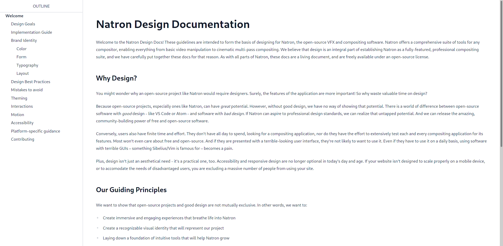

# Natron Design Docs (Unofficial)

A community-driven effort to provide design guidelines for Natron, the open-source compositor.



## Overview

I am a proud member of the [Natron](https://github.com/NatronGithub/Natron) community, and like many like-minded community members, Natron's slow downfall and lack of development deeply affected us. That's why we decided to rejuvenate Natron, with a [website redesign effort](#), a [UI refresh](#), and lots of cool stuff!

To organize all of that design-related stuff, we create these docs pages. View them live at <https://songtech-0912.github.io/natron-design-docs>.

## Getting Started

### Easiest Way

You can read the docs online [here](https://github.com/Songtech-0912/Natron-Design-Docs/issues) without installing anything on your computer. If you see an issue or typo somewhere, report it to me [on GitHub](https://github.com/Songtech-0912/Natron-Design-Docs/issues)

### Second-Easiest Way

You can clone this repository to a local folder, and work on it that way. To do so, first open a terminal and run this:

```
git clone https://github.com/Songtech-0912/Natron-Design-Docs.git && cd Natron-Design-Docs
```

Then, assuming you have `npm` installed, you may begin generating the docs, like so:

```
npm run dev:dist
```

Then, navigate to <http://localhost:8080> to start viewing your local copy of the docs.

### Advanced Way (for developers)

Fork this repo, make your changes, and create a pull request to merge your changes. This should be relatively self-explanatory. 

## TODOs

- [ ] Generate PDF version of docs
- [ ] Enhance `print.css` rules
- [ ] Clicking on links should jump heading anchors (e.g. `#welcome`, `#implementation`)
